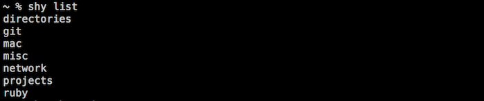
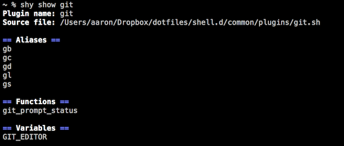

# shy - minimal shell "plugins"

Shy is a small tool for managing shell (bash/zsh) confiuration that is split into several files. A "plugin" is merely a file with plain old shell aliases, functions, variables, or anything else - they work the same whether or not Shy is installed.

Using Shy allows you to do the following:

 * Organize your shell config into groups of related functionality (plugins) in a lightweight way
 * Quickly find where things (functions, aliases, variables) are defined
 * Open your editor with the appropriate file, to make a quick change
 * And (not much) more!

[Installation](#installation)  
[Usage](#usage)  
[Why Use This?](#why)  
[Command Reference](#command-reference)  
[Advanced Configuration](#advanced-configuration)  
[Credits](#credits)  

<a name="installation"/>
## Installation

1. Download the [shy script](https://raw2.github.com/aaronroyer/shy/master/shy) and place it somewhere on your PATH (make sure it is executable)
1. Add ```eval "$(shy init)"``` in .bashrc (or .zshrc if using zsh), somewhere after configuring your PATH
1. Add some plugins! See [usage](#usage) for more info.

<a name="usage"/>
## Usage

Once you're installed then you can used ```shy load``` to load plugin files. You will usually do this in your .bashrc/.zshrc file. Make sure Shy is initialized before loading plugins.

```
shy load ~/path/to/plugin.sh
```
Or maybe something like

```
for plugin in ~/.shell_plugins/* do
  shy load $plugin
done
```

Shy will source the files as normal, but also record all of the aliases, functions, and variables first defined in the file.

Now you can view a list of your plugins. The name of a plugin is the base file name with any extension removed.



You can examine the details of a plugin.



Use ```which``` if you want to know where something is defined.

```
 $ shy which glb
 glb is a function in the plugin git
 $ shy which gd
 gs is an alias in the plugin git
```

You can open a plugin (or anything else) in your EDITOR.

```
 $ shy edit git
 # (opens the git plugin source file in your editor)

 $ shy edit gs
 # (opens the git plugin source file, where the alias gs is defined)
```

<a name="why"/>
## Why Use This?

You should try Shy if you like to maintain your own shell config, want to split things into separate files, want to be able to keep track of it all and make tweaks with ease, and don't want something heavy to do it.

If you want lots of crazy/awesome power-user features you might like something like [composure](https://github.com/erichs/composure) instead. If you use zsh and just want to dump a ton of functionality that someone else wrote into your shell and be done with it then you could use [oh-my-zsh](https://github.com/robbyrussell/oh-my-zsh).

I prefer to keep a set of often-used tools that I've put together myself (with little bits I've stolen) and manage them with simple tools.

<a name="command-reference"/>
## Command Reference

#### shy load <plugin_path>

Load a plugin file. This simply sources the file and Shy records the aliases, functions, and variables first defined in the file.

This should normally be used in your shell configuration files (like .bashrc or .zshrc) and not interactively.

---

#### shy list

List the plugins that that have previously been loaded with ```load```. Names of plugins are the plugin file names with any extension removed.

For example:

```~/.shell_plugins/git.sh``` is a plugin named ```git```

```~/.shell_plugins/rails``` is a plugin named ```rails```

---

#### shy show \<plugin_name\>

Show the details for the plugin. This prints the path of the plugin file, and lists the aliases, functions, and variables defined in the plugin.

---

#### shy edit \<plugin_or_other_item_name\>

Open a plugin file in your editor. When given a plugin name, the plugin file is opened. When given the name of an alias, function, or variable the plugin file where that item is defined is opened in the editor.

To find an editor to use, Shy first checks the variable ```SHY_EDITOR```, then ```EDITOR```, then falls back on ``vim```.

---

#### shy which \<item_name\>

Print what plugin an alias, function, or variable is defined in.

---

#### shy help \[\<command_name\>\]

Prints help for a specific command, or general help with no command name given.

<a name="advanced-configuration"/>
## Advanced Configuration

If you want everything to work even if Shy is not installed (like if you sync your dotfiles but don't sync Shy along with it) then you can add a fallback function that simply sources your plugin files. This way your shell works the same even if ```shy``` isn't on your ```PATH```.

```
if which shy &> /dev/null; then
  eval "$(shy init)"
else
  shy() { [ "$1" = 'load' ] && source "$2"; }
fi
```

### Environment Variables

```SHY_EDITOR``` - sets the editor to use with Shy

```SHY_DEBUG``` - prints debug info to standard out when loading plugins

```SHY_CACHE_DIR``` - Shy caches plugins in ```~/.shy_plugin_cache```for faster startup; this overrides the default location

```SHY_NO_COLOR``` - Set this to anything not empty to prevent Shy from coloring any output

<a name="credits"/>
## Credits

Shy uses [Bats](https://github.com/sstephenson/bats) for automated testing. You should check it out if you're doing anything non-trivial with Bash.

## License

Shy is MIT licensed
